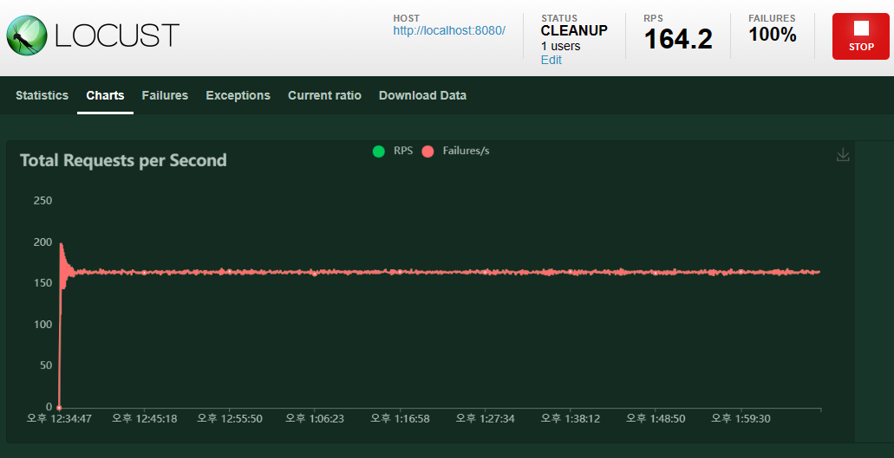
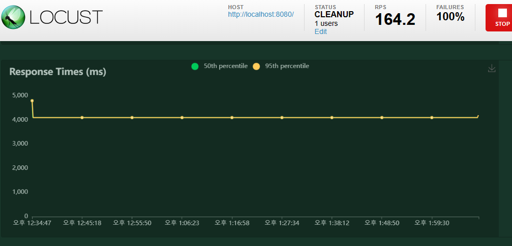
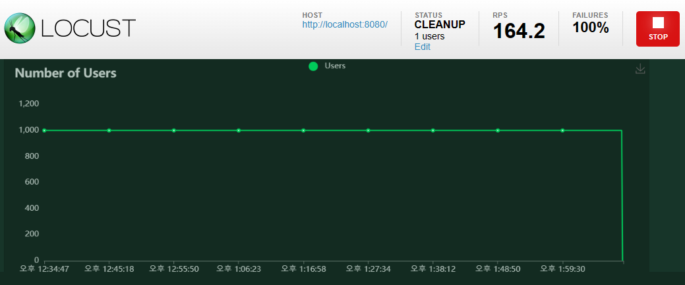

## Testing

### Locust를 활용

1. pandas와 Numpy를 활용하여 CSV 파일을 읽는다.

2. 나는 수업때 활용헀던 데이터 파일을 활용하였다.

3. 그렇기에 따로 app이나 pjt를 만들 필요가 없었고,
data 폴더만 pjt 폴더와 같은 위치로 저장하였다.

4. A의 요구사항인 반환 코드는 주어진 코드를 활용하였고, Url route를 read_CSV로 만들고 관련 함수를 view안에 지정하여 준비하였다.

5. B의 요구사항인 결측치 처리 후 데이터 반환 경우,
  - Pandas_Advanced를 참고하여, test_data가 아닌 test_data_has_null 파일로 읽어오고 그 안에서 filna method로 'Null'로 변환시킨다음 inplace= True로 지정해준다. 모든 Nan 으로 된 항목은 Null로 변경되었다.

6. C의 요구사항인 알고리즘 구현하기
  - Pandas_Advanced를 참고하여, 특정 method를 활용하였다. mean.. 읽은 csv파일을 df으로 저장한 뒤,
  df['나이'].mean() 으로 평균 치를 구하며, 비슷한 나이 즉 각 나이로 부터 mean값을 뺀 가장 낮은 데이터 하위 10항목을 DataFrame으로 만들어 반환하였다.
  * 모든 항목에 대한 Return은 JSON으로 반환하였기에 JSONResponse으로 반환 하여 'dat'필드의 하위 data값 응답

7. 각 함수에 대해 testing을 위해 loctus.py에 각 함수들을 한개씩 켠 상태로, 서버를 켜며 그에 대한 테스팅 시작 
Number of users : 1000
Spawn rate : 1000

 -Total Requests per Second
 - Response Times(ms)
 - Numbers of Users

사진을 보면 알 수 있듯이, 초당 총응답수는 '160'대에 일정해지고, 응답 시간은 '4.1'초에서 일정해진다.
동시 접속자 : 1000명으로 일정하다.
Testing 1시간 반정도 지난 후에는 testing이 자동 종료가 된듯 하다.

* 일반적으로 3분내로 서버가 안정화 되며, 10000 / 10000값을 지정 했을 때, 2분도 안되어 CPU의 90% 이상이 할당되어졌다. 동시에 많은 수의 인원이 버틸 수 있게 만드려면 서버 확충등 알고리즘의 최적화 방식이 필요할 것이다.
