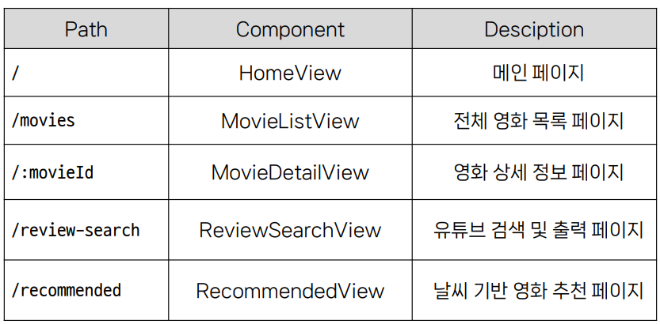

## Vue를 사용한 동영상 검색 관리 서비스 구현
### router 및 컴포넌트
  

A. 최고 평점 영화 조회
  1) Nav bar를 App.vue 상단에 작성
  2) 조회 링크 /movies에 클릭하여 AJAX 통신을 이용하여 TMDB(영화 정보 사이트) API로 부터 JSON 데이터를 받아와 영화 목록 출력
  3) 구글링으로 TMDB 에서 API 등록을 하여 key 값을 저장한뒤,
  4) 영화의 평점 순으로 조회 
  5) 각 영화의 Movie Card으로 Components로 구성하여, 이미지와 그에 맞는 영화 제목, 줄거리로 나타냄
  * 문제점 : Frame 을 짠 이후, CSS으로 각 카드 size를 반응형에 따라 그리고 조절할 예정이었지만, 코드 위치가 헷갈려 적용을 못했음.

B. 최고 평점 영화의 상세정보 조회
  1) 영화 제목, 개봉일, 러닝타임, 평점, 장르, 줄거리
  2) 공식 예고편 영상 조회
  3) MovieDetailView으로 만들어 놓은 새 Page에 해당되는 영화의 정보 1) 을 나타내며, Youtube 로고를 클릭 시, 영화의 예고편이 나오게 구성
  4) Youtube의 API경우, 구글링으로 받아왔으며 Google Cloud Console 환경에서 API 생성
  5) Youtube 검색에 따라 단어와 관련있는 영화의 정보를 검색할 수 있는 검색창을 생성
  * API key를 암호화하기 위해 .env로 관리를 하려고 하였으나 fetch 함수에서 URL으로 응답받지 않는 문제가 발생

C. 영화 리뷰 영상 조회
  1) AXIOS를 활용하여, 영화에 대한 유튜브 리뷰를 따로 추출하였다.

D. [도전 과제] 현재 날씨에 따른 영화 추천하기