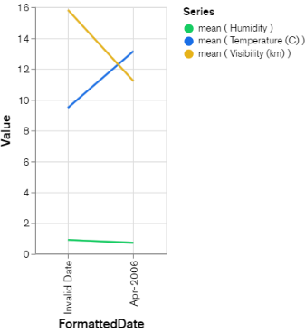

### 구성
  1) MongoDB Atlas 클러스터를 프로비저닝합니다.

  2) 그 안에 데이터베이스와 컬렉션을 만들고 초기 데이터 세트를 로드합니다.
     
  3) MongoDB Atlas Data API를 설정하고 API 키를 생성합니다.
    
  4) 변경 스트림 IIoT 데이터를 읽을 수 있는 Pub/Sub 주제를 만듭니다.
    
  5) Pub/Sub를 소스로, Cloud 함수를 대상으로 사용하여 Eventarc 트리거를 만듭니다.
    
  6) MongoDB Atlas Data API를 사용하여 MongoDB에 데이터를 쓰는 Cloud 함수를 만듭니다.
    
  7) 데이터를 표시하고 시각화하도록 MongoDB Atlas Charts를 구성합니다.
    
  8) Cloud 함수를 실행하여 Pub/Sub에 데이터를 게시하는 IIOT 센서를 시뮬레이션합니다.

## 진행

1. 몽고 DB 회원가입

2. 구글 클라우드 Console 전용 아이디 생성

3. 몽고 DB에 날씨 정보에 관련된 DB를 넣어 데이터 파이프 라인을 구축할 예정임.

4. 몽고 DB에 공유용 기본 M0 cloud datase를 만듬.
  Cloud Provider & Region : Google Cloud & Asia nation(큰 의미 x)

5. Cluster name : Sandbox 
    MongoDB Atlas 특성상 같은 cluster가 있으면 삭제하고 만들 수 있음.

6. 만들어진 DB로 Browse Collection에서 데이터 형식을 만들어준다.
DB id : Weather-station,
collection : sensor

7. 이후 만들어진 DB에서 Insert Doc 항목에서 실제 Data를 기입해 준다.
for ex) 
```Json
{
    "Formatted Date":{"$date":{"$numberLong":"1143842400000"}},
    "Summary":"Partly Cloudy",
    "Precip Type":"rain",
    "Temperature (C)":{"$numberDouble":"9.472222222222221"},
    "Apparent Temperature (C)":{"$numberDouble":"7.3888888888888875"},
    "Humidity":{"$numberDouble":"0.89"},
    "Wind Speed (km/h)":{"$numberDouble":"14.1197"},
    "Wind Bearing (degrees)":{"$numberInt":"251"},
    "Visibility (km)":{"$numberDouble":"15.826300000000002"},
    "Loud Cover":{"$numberInt":"0"},
    "Pressure (millibars)":{"$numberDouble":"1015.13"},
    "Daily Summary":"Partly cloudy throughout the day."
}
```
```Json
{
   "FormattedDate":{"$date":{"$numberLong":"1143910800000"}},
   "Summary":"Mostly Cloudy",
   "Precip Type":"rain",
   "Temperature (C)":{"$numberDouble":"13.144444444444442"},
   "Apparent Temperature (C)":{"$numberDouble":"13.144444444444442"},
   "Humidity":{"$numberDouble":"0.7"},
   "Wind Speed (km/h)":{"$numberDouble":"7.631400000000001"},
   "Wind Bearing (degrees)":{"$numberInt":"139"},
   "Visibility (km)":{"$numberDouble":"11.2056"},
   "Loud Cover":{"$numberInt":"0"},
   "Pressure (millibars)":{"$numberDouble":"1015.83"},
   "Daily Summary":"Partly cloudy throughout the day."
}
```

8. 이후 Data API를 만들어 준다.
Select data sources 에서 Sandbox cluster를 적용 시킨후 만들어줌. Data API Access : Read and Write

Url Endpoint : https://us-west-2.aws.data.mongodb-api.com/app/data-adftu/endpoint/data/v1
API key(weather-station-api-key
) : 6541ef150f330b2598176c73


9. MongoDB Atlas 에서 chart를 통해 가시화 시켜준다.
Add Chart : weather-station
  1) data source의 경우 기존 만들어 놓은
    route : Sandbox(Cluster) -> Weather-station -> sensor
  2) Discrete Line : x-axis, y-axis, z-axis 가 있는데 현재 시간 당 온도, 습도로 가시화 시킬 예정
  3) x-axis : Formatted Date field
  4) y-axis : Humidity and Tempertature fields

10. Google Cloud Console 로부터 data가 읽혀지는지 서버에 등록된 사항 확인 
  - Analytics -> Pub/Sub -> Topics

11. Triggers 사용 (데이터 상호 작용 구현)
  - route : Integration Services -> Eventarc -> Triggers
Trigger 특징 :
  1) Audit
    - DB에 레코드 변경한 사항을 기록하는 기능
  2) Data Consistency
    - 입력 데이터가 일관되었는지, 필드 형식 관계없이 보장
  3) Data Integrity
    - 조건부 논리를 추가하여, 유효한 데이터 조합이 있는지 확인 기록 이전의 날짜등 확인 가능
  4) Data Events
    - 컬렉션 생성 이후, 발생하는 이벤트에 알림
  
  - Trigger parameters:
Property	: value
Trigger name	: weather-sensor
Trigger Type	: Google sources
Event Provider	: Cloud Pub/Sub
Event	: google.cloud.pubsub.topic.v1.messagePublished
Select a Cloud Pub/Sub topic: 	weather-sensor-trigger
Region : The one allocated to you for the project
Event Destination	: Cloud Functions

  - Cloud Function Configurations:
Property	: Value
Environment	: 2nd gen
Function :  Name	weather-sensor-function
Region	: Same as that of the Eventarc trigger
Trigger Authentication	: Allow unauthenticated invocations
Runtime, Build, connections and security settings	: Runtime: Memory allocated - 512 MB Timeout: 540 seconds  


12. Runtime : Python 3.9 or 3.10 수정
  - 메인 안의 url 주소나 api key 경우 이전에 기록해둔 값을 지정.
  1) main.py ;  

```python
import base64
import functions_framework
# Triggered from a message on a Cloud Pub/Sub topic.
@functions_framework.cloud_event
def hello_pubsub(cloud_event):
 api_key = "paste the api key copied from Setup Data API from MongoDB step"
 url = "Paste the Data API copied from Step Setup Data API from MongoDB data services"+"/action/insertOne"
 import requests
 import json
 payload = json.dumps({
   "collection": "sensor",
   "database": "Weather-station",
   "dataSource": "Sandbox",
   "document": json.loads(base64.b64decode(cloud_event.data["message"]["data"]).decode("utf-8"))
 })
 headers = {
   'Content-Type': 'application/json',
   'Access-Control-Request-Headers': '*',
   'api-key': api_key,
 }
 print(payload)
 response = requests.request("POST", url, headers=headers, data=payload)
 return response
```

  2) requirement.txt ;
functions-framework==3.*
requests



13. Testing
- Cloud Function의 'sensor-data-generator' 클릭 후, Triggers, data 등 항목 확인 


### Result ;
  - MongoDB Atlas와 Google Cloud Eventarc, Cloud Pub/Sub, Cloud 기능을 사용하여 IoT 사용 하고 구축하였으며, MongoDB 데이터 API를 사용하여 MongoDB에서 읽고 쓰는 방법과 MongoDB 차트를 사용하여 데이터를 시각화 하였습니다.
