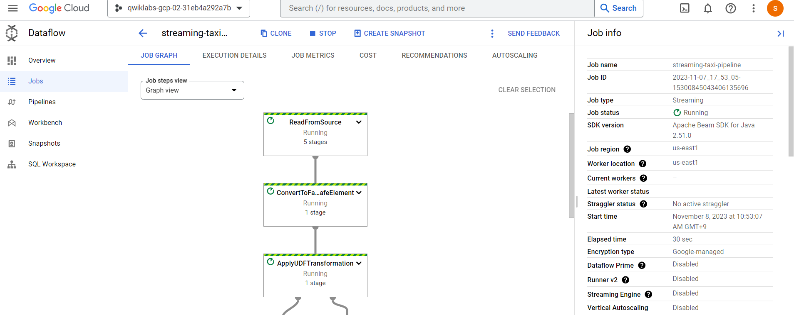
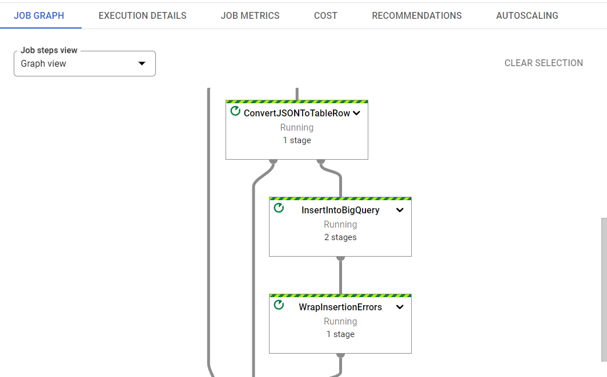
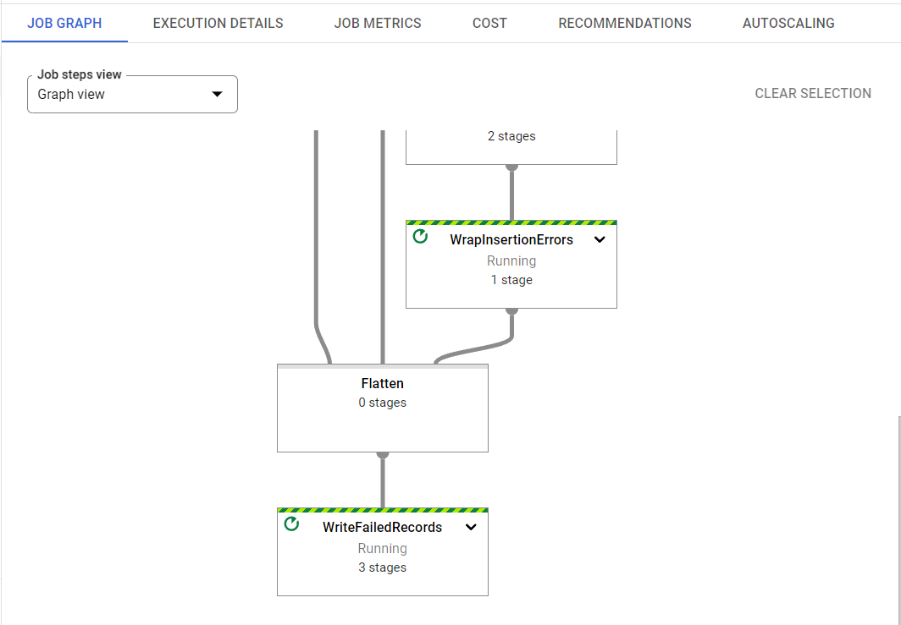

## Google Cloud 환경에서 실시간으로 Data pipeline 처리
### 뉴욕 택시의 수익, 승객 수, 탑승 상태등의 정보를 실시간 데이터 처리하고, 시각화 

1. 구글 클라우드의 계정 접속

2. 구글 클라우드 shell을 동작시킨다.
  - shell의 경우 개발 툴을 불러오는 가상 머신이며, 5GB 영구로 사용가능하다.
  - 구글 클라우드 우측 상단의 cloud shell active 활성화

3. shell 개발 환경에서 명령어로 특정 결괏값 도출
  - gcloud auth list
  - gcloud config list project

4. Bigquery dataset 제작(taxirides)
  - Google Cloud Shell or Console 로 가능
  - https://opendata.cityofnewyork.us/ 사의 open dataset 이용
  - BigQuery : 서버없는 '데이터 웨어하우스'이다. 
  - 해당 프로젝트에서는 Shell로 구동
  1) taxirides -create dataset
    - bq --location=us-east1 mk taxirides
  2) taxirides.realtime -create table
    - ```bq --location=us-east1 mk \
      --time_partitioning_field timestamp \
      --schema ride_id:string,point_idx:integer,latitude:float,longitude:float,\
      timestamp:timestamp,meter_reading:float,meter_increment:float,ride_status:string,\
      passenger_count:integer -t taxirides.realtime```

  - Console에서 실행할 경우,
  1) Google Cloud -> BigQuery -> Create dataset(ID : click)
  2) Dataset ID : taxirides 
  3) Data location : us-east1
  4) Create Table (open taxirides dataset) 
  5) Table type : realtime
  6) schema ;
    - ride_id:string,
      point_idx:integer,
      latitude:float,
      longitude:float,
      timestamp:timestamp,
      meter_reading:float,
      meter_increment:float,
      ride_status:string,
      passenger_count:integer
  7) option : timestamp

5. 프로젝트에서 필수 파일을 옮긴다.
  1) Shell 환경에서 아래 코드 타이핑
  - ```gcloud storage cp gs://cloud-training/bdml/taxisrcdata/schema.json  gs://qwiklabs-gcp-02-31eb4a292a7b-bucket/tmp/schema.json
    gcloud storage cp gs://cloud-training/bdml/taxisrcdata/transform.js  gs://qwiklabs-gcp-02-31eb4a292a7b-bucket/tmp/transform.js
    gcloud storage cp gs://cloud-training/bdml/taxisrcdata/   rt_taxidata.csv  gs://qwiklabs-gcp-02-31eb4a292a7b-bucket/tmp/rt_taxidata.csv

6. Dataflow Pipeline 설치
  - Dataflow : 데이터 분석을 서버없이 가져오는 방법
  1) Datafolw API를 프로젝트와 재연결한다
    - gcloud services disable dataflow.googleapis.com
    gcloud services enable dataflow.googleapis.com
  2) 이후 Console의 Dataflow에서 Create Job From Template 실행
    - 순서
    2.1) Name of type : streaming-taxi-pipeline
    2.2) Regional endpoint : us-east1
    2.3) Datafolw template : Text Files on Cloud Storage to BigQuery
    2.4) Cloud Storage location of your JavaScript UDF
    2.5) Cloud Storage location of your BigQuery schema file, described as a JSON
    2.6) The name of the JavaScript function you wish to call as your UDF
      - transform
    2.7) The fully qualified BigQuery table
    2.8) The Cloud Storage location of the text you'd like to process
    2.9) Temporary directory for BigQuery loading process
    2.10) Temporary location
    2.11) Optional Parameters
    2.12) Max workers : 2
    2.13) Number of workers : 1
    2.14) Uncheck user default machine type
    2.15) General purpose
      - Series: E2
        Machine type: e2-medium (2 vCPU, 4 GB memory)
  3) Data Pipeline (Graph view)
  
  
  

7. BigQuery로 부터 SQL 명령 실행 및 결괏값
  - SELECT * FROM taxirides.realtime LIMIT 10

  
  