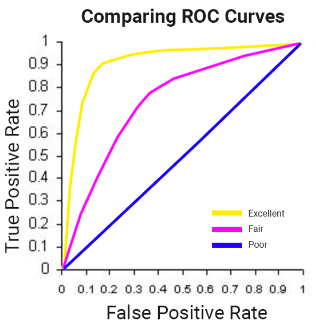

## 목표
  1. BigQuery를 이용하여, dataset을 찾을 것
  2. 전자상 거래 dataset 탐색 및 Query
  3. batch prediction에 사용할 학습 및 평가 dataset 만들기
  4. BigQuery ML에서 분류 회귀 모델 만들기
  5. ML 모델의 역량 측정
  6. 방문자의 구매 가능성에 대한 순위와 예측

### Google Cloud BigQuery
  1. 학습 dataset 접근
  2. 전자상 거래 data 탐색
    - 전체 웹사이트 방문자 중, 몇 %가 구매할까?
    '''SQL
    #standardSQL
    WITH visitors AS(
    SELECT
    COUNT(DISTINCT fullVisitorId) AS total_visitors
    FROM `data-to-insights.ecommerce.web_analytics`
    ),
    purchasers AS(
    SELECT
    COUNT(DISTINCT fullVisitorId) AS total_purchasers
    FROM `data-to-insights.ecommerce.web_analytics`
    WHERE totals.transactions IS NOT NULL
    )
    SELECT
      total_visitors,
      total_purchasers,
      total_purchasers / total_visitors AS conversion_rate
    FROM visitors, purchasers
    '''
    
    - 상위 5위 안의 품목은?
    '''SQL
    SELECT
      p.v2ProductName,
      p.v2ProductCategory,
      SUM(p.productQuantity) AS units_sold,
      ROUND(SUM(p.localProductRevenue/1000000),2) AS revenue
    FROM `data-to-insights.ecommerce.web_analytics`,
    UNNEST(hits) AS h,
    UNNEST(h.product) AS p
    GROUP BY 1, 2
    ORDER BY revenue DESC
    LIMIT 5;
    '''

    - 사이트에서 얼마나 많은 방문자들이 재방문하여 구매했을까?
    '''
    # visitors who bought on a return visit (could have bought on first as well
    WITH all_visitor_stats AS (
    SELECT
      fullvisitorid, # 741,721 unique visitors
      IF(COUNTIF(totals.transactions > 0 AND totals.newVisits IS NULL) > 0, 1, 0) AS will_buy_on_return_visit
      FROM `data-to-insights.ecommerce.web_analytics`
      GROUP BY fullvisitorid
    )
    SELECT
      COUNT(DISTINCT fullvisitorid) AS total_visitors,
      will_buy_on_return_visit
    FROM all_visitor_stats
    GROUP BY will_buy_on_return_visit
    '''

  3. 학습 dataset을 구성하고, 특성 조회
    - totals.bounces : 방문자가 바로 웹사이트를 나가는지
    - totals.timeOnSite : 방문자가 얼마라 오래 머무르는지
    Machine Learning 특성 ;
      1) 충분한 데이터가 있어야 정확한 모델을 출력
      2) 입력 기능과 레이블간의 관계의 정확성이 도출값이 비례된다
      3) 첫번째 구매 이후의 데이터를 활용하여 추후 구매력을 예측함
    - bouces 와 timeOnSite 특성으로써는 ML로 연계성이 없는 결과를 도출함
    - Result : 10순위 안 오래머문 방문자중 1명만이 구매함(유망없는 데이터 집합)

  4. Machine Learning 모델 저장

  5. BigQuery ML 모델 특성과 type 조회
    - 
    - ML 학습
    '''SQL
    CREATE OR REPLACE MODEL `ecommerce.classification_model`
    OPTIONS
    (
    model_type='logistic_reg',
    labels = ['will_buy_on_return_visit']
    )
    AS
    #standardSQL
    SELECT
      * EXCEPT(fullVisitorId)
    FROM
      # features
      (SELECT
        fullVisitorId,
        IFNULL(totals.bounces, 0) AS bounces,
        IFNULL(totals.timeOnSite, 0) AS time_on_site
      FROM
        `data-to-insights.ecommerce.web_analytics`
      WHERE
        totals.newVisits = 1
        AND date BETWEEN '20160801' AND '20170430') # train on first 9 months
      JOIN
      (SELECT
        fullvisitorid,
        IF(COUNTIF(totals.transactions > 0 AND totals.newVisits IS NULL) > 0, 1, 0) AS will_buy_on_return_visit
      FROM
          `data-to-insights.ecommerce.web_analytics`
      GROUP BY fullvisitorid)
      USING (fullVisitorId);
    '''

  6. 분류 모델 역량 측정
    - ML 분류 문제의 경우 False PositiveRate(사용자가 반품하고 구매할 것을 예측)을 최소화하고 True PositiveRate(사용자가 반품하고 구매할 것을 예측)을 최대화하려고 합니다.

    이 관계는 여기에 표시된 것과 같은 ROC(Receiver Operating Charateristic) 곡선으로 시각화됩니다. 곡선 아래 영역 또는 AUC를 최대화하려고 합니다.
    -  예시 그림

  7. Engineering 특성에 따른 모델 역량 향상
    - 앞서 제시한 모델 첫번째 구매 이후로, 재방문하여 구매한 구매자들의 데이터로 좋은 결과값을 도출할 수 있을 것이라 예측
    - 방문자의 정보를 통하여 ML 학습 (지역, 접속 기기, 방문 경로, 첫 방문 이후 결제 프로세스 정도)
    '''SQL
    #standardSQL
    SELECT
      roc_auc,
      CASE
        WHEN roc_auc > .9 THEN 'good'
        WHEN roc_auc > .8 THEN 'fair'
        WHEN roc_auc > .7 THEN 'not great'
      ELSE 'poor' END AS model_quality
    FROM
      ML.EVALUATE(MODEL ecommerce.classification_model_2,  (
    WITH all_visitor_stats AS (
    SELECT
      fullvisitorid,
      IF(COUNTIF(totals.transactions > 0 AND totals.newVisits IS NULL) > 0, 1, 0) AS will_buy_on_return_visit
      FROM `data-to-insights.ecommerce.web_analytics`
      GROUP BY fullvisitorid
    )
    # add in new features
    SELECT * EXCEPT(unique_session_id) FROM (
      SELECT
          CONCAT(fullvisitorid, CAST(visitId AS STRING)) AS unique_session_id,
    # labels
        will_buy_on_return_visit,
        MAX(CAST(h.eCommerceAction.action_type AS INT64)) AS latest_ecommerce_progress,
        <!-- # behavior on the site -->
        IFNULL(totals.bounces, 0) AS bounces,
        IFNULL(totals.timeOnSite, 0) AS time_on_site,
        totals.pageviews,
        <!-- # where the visitor came from -->
        trafficSource.source,
        trafficSource.medium,
        channelGrouping,
        <!-- # mobile or desktop -->
        device.deviceCategory,
        <!-- # geographic -->
        IFNULL(geoNetwork.country, "") AS country
    FROM `data-to-insights.ecommerce.web_analytics`,
        UNNEST(hits) AS h
      JOIN all_visitor_stats USING(fullvisitorid)
    WHERE 1=1
       <!-- only predict for new visits -->
      AND totals.newVisits = 1
      AND date BETWEEN '20170501' AND '20170630' # eval 2 months
    GROUP BY
    unique_session_id,
    will_buy_on_return_visit,
    bounces,
    time_on_site,
    totals.pageviews,
    trafficSource.source,
    trafficSource.medium,
    channelGrouping,
    device.deviceCategory,
    country
    )
    ));
    '''
    - ML 학습 결과 : AUC 0.91으로 향상된 결괏값을 도출 

  8. 신규 방문자의 재방문과 구매 예측 (7의 ML으로 활용)
    - Result ;
      1) 첫 방문자 중 상위 6% 고객의 최근 방문 6%이상이 구매
      2) 해당 구매자들이 최초 구매자들의 50%이상을 나타냄
      3) 전체적으로, 0.7%정도의 첫방문자들이 구매
      4) 첫 방문자의 상위 6% 고객들을 타겟으로 마켓팅 할 시, ROI 가 9배 증가

  ### 다양한 연관 데이터의 ML학습으로 더 유의미한 값을 도출 할 수 있으며, AUC 또한 수많은 도출 데이터 중 하나로 추가적인 의사결정 트리등으로 향상된 값을 나타낼 수 있음